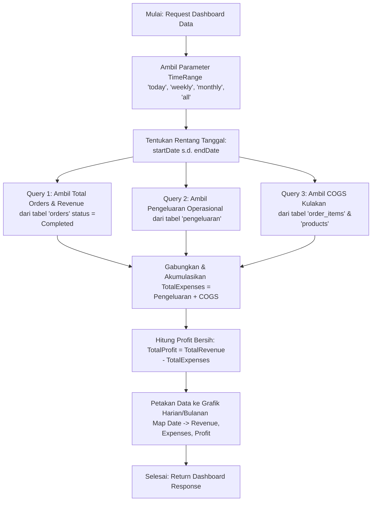

# Algoritma Perhitungan Statistik Dashboard SeliPOS

Dokumen ini menjelaskan rancangan, formula matematis, alur data, dan query database yang digunakan untuk menghasilkan metrik statistik pada Dashboard SeliPOS. Informasi ini disusun secara terstruktur untuk mempermudah penulisan laporan Tugas Akhir (TA).

---

## 1. Definisi Metrik & Formulasi Matematis

Dashboard SeliPOS menyajikan 4 metrik utama dalam bentuk kartu informasi ringkasan (*summary cards*) dan grafik perkembangan (*trend chart*). Metrik tersebut dihitung berdasarkan formula berikut:

### A. Total Orders (Total Transaksi)
Jumlah seluruh transaksi penjualan yang telah diselesaikan pada rentang waktu terpilih ($t$).
$$TotalOrders = \sum (Orders_{Completed})$$

### B. Total Revenue (Total Pendapatan Kotor)
Akumulasi total nominal transaksi penjualan bersih setelah diskon yang telah selesai (*status = 'Completed'*).
$$TotalRevenue = \sum_{i=1}^{n} (OrderAmount_i)$$
*Di mana $n$ adalah jumlah transaksi penjualan dengan status `Completed` pada periode terpilih.*

### C. Total Expenses (Total Pengeluaran)
Gabungan dari Pengeluaran Operasional Toko (dari modul pengeluaran) dan Biaya Pembelian Produk Kulakan (modal stok awal) yang dihitung langsung saat produk kulakan tersebut dibuat.
$$TotalExpenses = OperationalExpenses + PurchaseCosts_{Kulakan}$$
Di mana $PurchaseCosts_{Kulakan}$ dihitung menggunakan rumus:
$$PurchaseCosts_{Kulakan} = \sum_{j=1}^{p} (Stock_j \times PurchasePrice_j)$$
*Di mana $p$ adalah jenis produk bertipe 'Kulakan' yang dibuat dalam periode tersebut, $Stock$ adalah kuantitas stok produk awal, dan $PurchasePrice$ adalah harga beli produk.*

### D. Total Profit (Keuntungan Bersih)
Hasil bersih pendapatan setelah dikurangi total pengeluaran.
$$TotalProfit = TotalRevenue - TotalExpenses$$

---

## 2. Alur Algoritma (Flowchart)

Berikut adalah flowchart proses penarikan data dan kalkulasi statistik dashboard di backend SeliPOS:



---

## 3. Implementasi Query Database (PostgreSQL / Bun ORM)

### A. Query Total Revenue & Orders
Mengambil data langsung dari tabel `orders` dengan filter `store_id`, `status`, dan rentang waktu. Menggunakan `COALESCE` untuk menghindari nilai `NULL` jika tidak ada transaksi.

```sql
SELECT 
    COUNT(*) AS total_orders, 
    COALESCE(SUM(total_amount), 0) AS total_revenue 
FROM orders 
WHERE 
    status = 'Completed' 
    AND store_id = :store_id 
    AND created_at >= :start_date 
    AND created_at <= :end_date;
```

### B. Query Pengeluaran Operasional
Mengambil total pengeluaran operasional toko dari tabel `pengeluaran`.

```sql
SELECT 
    COALESCE(SUM(amount), 0) 
FROM pengeluaran 
WHERE 
    store_id = :store_id 
    AND tanggal >= :start_date 
    AND tanggal <= :end_date;
```

### C. Biaya Pembelian Produk Kulakan (Modal Stok Awal)
Mengambil total biaya pembelian produk kulakan berdasarkan perkalian stok awal dan harga beli dari tabel `products` saat produk didaftarkan/dibuat.

```sql
SELECT 
    COALESCE(SUM(p.stock * p.harga_beli), 0) 
FROM products AS p
WHERE 
    p.store_id = :store_id 
    AND p.created_at >= :start_date 
    AND p.created_at <= :end_date
    AND p.product_type = 'Kulakan';
```

---

## 4. Keunggulan Desain Algoritma

1. **Akurasi Profitabilitas Tinggi**: Perhitungan profit tidak hanya membandingkan penjualan dengan pengeluaran operasional biasa, melainkan juga memperhitungkan modal pembelian awal barang (*Cost of Goods Sold* / COGS) khusus untuk produk tipe Kulakan secara otomatis.
2. **Keamanan Nilai Kosong (Null-Safety)**: Penggunaan fungsi database `COALESCE(..., 0)` menjamin aplikasi Go tidak mengalami gangguan *crash* (seperti *nil-pointer dereference*) saat melakukan *binding* data ketika database kosong atau tidak memiliki riwayat transaksi pada filter tanggal tertentu.
3. **Agregasi Grafik Dinamis**: Di tingkat *Service Layer*, data penjualan harian, pengeluaran harian, dan COGS harian digabungkan secara dinamis menggunakan struktur data *Map* berbasis tanggal (`dateStr`) sehingga visualisasi grafik keuangan dapat terpetakan secara presisi dan cepat tanpa *double looping*.
